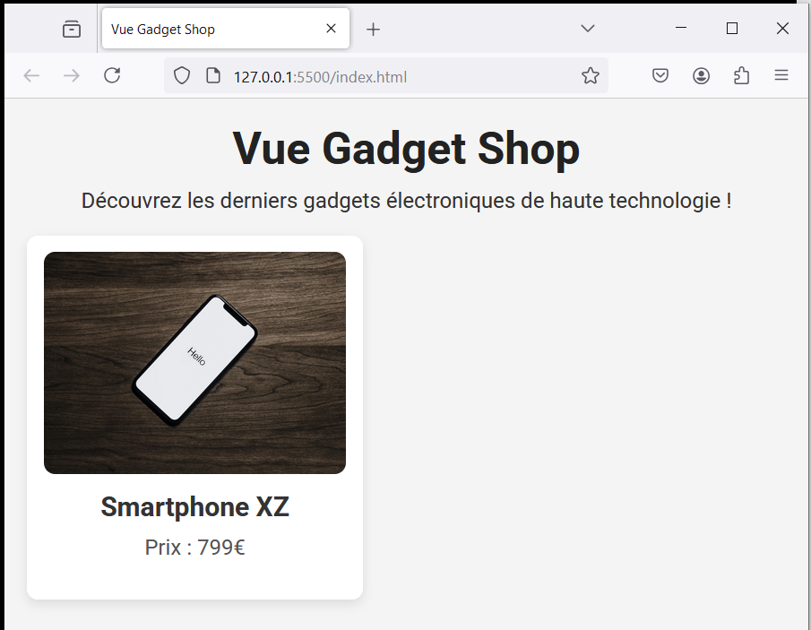

# Vue Gadget Shop

Nous allons concevoir une boutique en ligne minimaliste !

Pour réaliser cette application, nous allons utiliser Vuejs et l'API Option.

## Etape n°1

## Etape n°2

## Etape n°3

## Etape n°4

## Etape n°5

## Etape n°6

## Etape n°7

## Etape n°8

## Etape n°9

## Etape n°10

