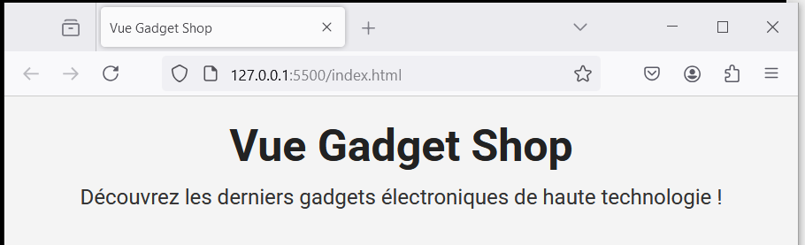

# Vue Gadget Shop - step1-challenge

## Structure du projet

```bash
/vue-gadget-shop
│── index.html
│── main.js
│── style.css
```

## Création de l’application Vue

Vous devez arriver au résultat suivant :



Pour cela, vous devez :

- définir une instance Vue avec Vue.createApp()
- lier les données `title` et `description` à notre `index.html`
- monter l’application `Vue` sur `#app`
