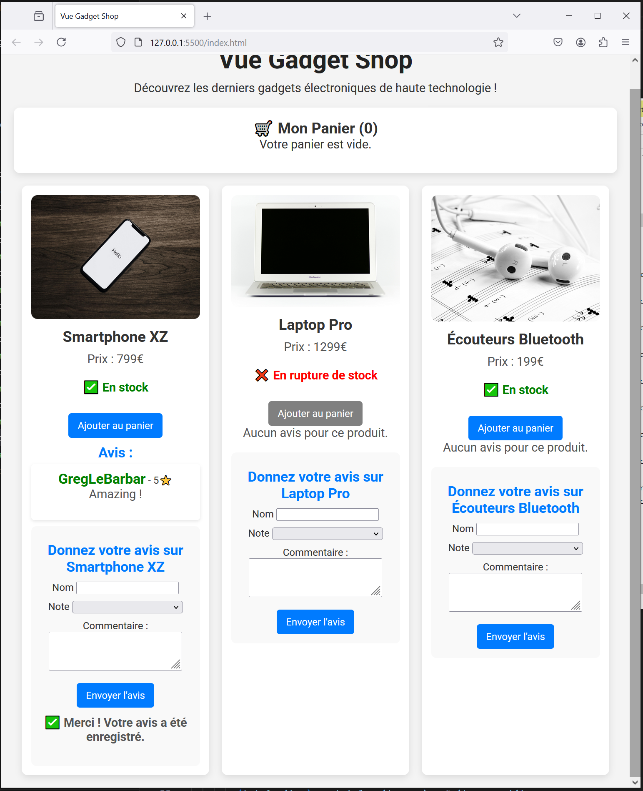

# Vue Gadget Shop - step10-challenge

## 🎯 Objectif

Dans cette étape, vous allez apprendre à **gérer des formulaires avec `v-model`** et à **associer des avis aux produits**. Vous devez permettre aux utilisateurs **de laisser un avis sur un gadget**.

Vous devez :
✅ Créer un **formulaire d’avis** permettant de capturer le **nom, la note et un commentaire**.
✅ Associer chaque avis au gadget concerné.
✅ Utiliser `v-for` pour **afficher les avis sous chaque produit**.

---

## 📂 Structure du projet

Votre projet doit contenir la structure suivante :

```bash
/vue-gadget-shop
│── index.html
│── main.js
│── style.css
│── /components
│    ├── GadgetDisplay.js
│    ├── CartDisplay.js
│    ├── ReviewForm.js
│── /assets
│    ├── phone.jpg
│    ├── laptop.jpg
│    ├── earbuds.jpg
```

---

## 🚀 Challenge

Vous devez arriver au résultat suivant :



### 🎯 À faire :

✅ **Modifier `main.js` pour stocker les avis**

- Ajouter un **tableau `reviews`** dans chaque gadget.
- Ajouter une **méthode `addReview(gadget, review)`** pour enregistrer un avis dans `reviews`.

✅ **Créer un composant `ReviewForm.js`**

- Ajouter un formulaire contenant :
  - Un champ texte pour le **nom** (`v-model`).
  - Un menu déroulant pour la **note** (`v-model`).
  - Une zone de texte pour le **commentaire** (`v-model`).
  - Un bouton "Envoyer" qui enregistre l'avis.
- **Émettre un événement `add-review`** pour transmettre l’avis au parent.

✅ **Modifier `GadgetDisplay.js` pour intégrer le formulaire et afficher les avis**

- Afficher **les avis existants** sous chaque produit avec `v-for`.
- Ajouter **le formulaire d’avis sous chaque produit**.
- Écouter `@add-review` et appeler `addReview(review)` pour enregistrer l'avis.

✅ **Ajouter du style pour améliorer l'affichage (`style.css`)**

- Styliser le formulaire et la liste des avis.

---

## 📌 Règles

- Vous devez **utiliser uniquement Vue.js (CDN) et CSS**.
- Vérifiez le rendu en ouvrant `index.html` dans votre navigateur.
- Assurez-vous que **les avis sont bien enregistrés et affichés sous le bon gadget**.

💡 Une fois terminé, **comparez votre solution avec `step10-solution.md`** pour voir si vous avez tout bien implémenté ! 🚀
