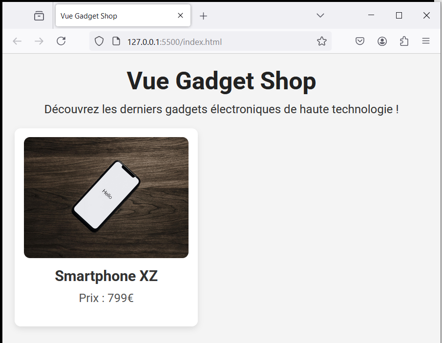

# Vue Gadget Shop - step2-challenge

## Défi : Affichage dynamique d'un gadget

Dans cette étape, vous devez compléter l'affichage d'un gadget en utilisant Vue.js et la fonction `data()`.

### 🎯 Objectifs

- Définir des données dynamiques pour afficher un gadget.
- Lier ces données aux éléments HTML.
- Utiliser `v-bind` pour afficher une image dynamiquement.

---

## 📂 Structure du projet

Votre projet doit contenir la structure suivante :

```bash
/vue-gadget-shop
│── index.html
│── main.js
│── style.css
│── /assets
│    ├── phone.jpg
```

---

## 🚀 Challenge

Vous devez arriver au résultat suivant :



### 🎯 À faire :

✅ **Initialiser les données dynamiques :**

Dans `main.js`, ajoutez un objet `data()` contenant les informations du gadget (titre, description, nom, prix, et image).

✅ **Lier les données à l'interface :**

Dans `index.html`, utilisez les accolades `{{ }}` pour afficher dynamiquement le titre, la description, le nom et le prix du gadget.

✅ **Afficher l'image dynamiquement :**

Utilisez `v-bind:src` pour lier correctement l'image du gadget définie dans `data()` à l'élément ``.

✅ **HTML du gadget**

Voilà la structure HTML à respecter pour que l'affichage soit identique au résultat attendu.

```html
<div class="gadget">
  
  <h2>Nom</h2>
  <p>prix</p>
</div>
```

✅ **Vérifier le rendu :**

Testez votre code en ouvrant `index.html` dans le navigateur et assurez-vous que toutes les informations s'affichent correctement.

✅ **Tester la réactivité :**

Essayez de modifier les valeurs dans `data()` et observez les changements instantanés dans l'affichage.

---

💡 Une fois terminé, **comparez votre solution avec `step2-solution.md`** pour voir si vous avez tout bien implémenté ! 🚀

Bonne chance ! 🚀
