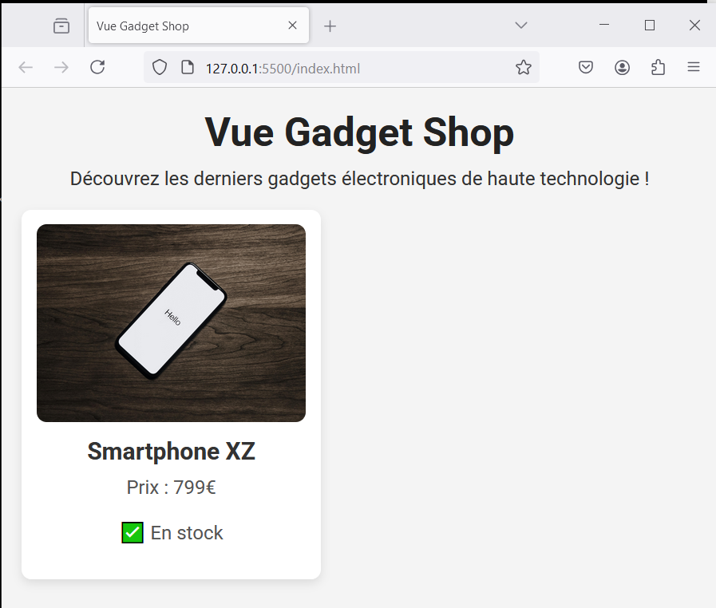

# Vue Gadget Shop - step3-challenge

## 🎯 Objectif

Dans cette étape, vous allez apprendre à **afficher ou masquer dynamiquement des éléments** en fonction d’une condition avec Vue 3 en utilisant **`v-if` et `v-else`**.

L’objectif est d’afficher dynamiquement **l’état du stock d’un produit** :

- ✅ **Si le produit est en stock, afficher "En stock".**
- ❌ **Si le produit est en rupture de stock, afficher "En rupture de stock".**

---

## 📂 Structure du projet

Votre projet doit contenir les fichiers suivants :

```bash
/vue-gadget-shop
│── index.html
│── main.js
│── style.css
│── /assets
│    ├── phone.jpg
```

---

## 🚀 Challenge

Vous devez arriver au résultat suivant :



### 🎯 À faire :

✅ **Ajouter une condition d’affichage du stock**

- Dans `index.html`, utilisez **`v-if`** et **`v-else`** pour afficher :
  - ✅ "En stock" si `inStock` est `true`.
  - ❌ "En rupture de stock" si `inStock` est `false`.

✅ **Mettre à jour `main.js`**

- Ajouter une variable **`inStock`** dans `data()` et lui attribuer `true` ou `false`.
- Vérifier que l’affichage change dynamiquement lorsque `inStock` est modifié.

✅ **Personnaliser le style**

- Ajoutez du CSS dans `style.css` pour différencier visuellement les produits en stock et hors stock.

---

## 📌 Règles

- Vous devez **utiliser uniquement Vue.js (CDN) et CSS**.
- Vérifiez le rendu en ouvrant `index.html` dans votre navigateur.
- Assurez-vous que **le texte change dynamiquement** lorsque `inStock` est modifié.

💡 Une fois terminé, **comparez votre solution avec `step3-solution.md`** pour voir si vous avez tout bien implémenté ! 🚀
