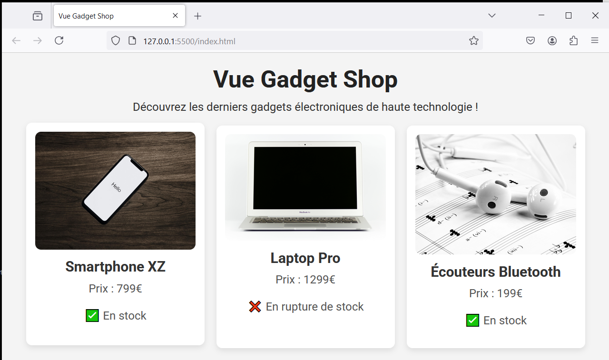

# Vue Gadget Shop - step4-challenge

## 🎯 Objectif

Dans cette étape, vous allez apprendre à **générer dynamiquement des listes** avec Vue 3 en utilisant **`v-for`**. L’objectif est d’afficher **une liste de gadgets**, chacun avec ses propres informations.

---

## 📂 Structure du projet

Votre projet doit contenir la structure suivante :

```bash
/vue-gadget-shop
│── index.html
│── main.js
│── style.css
│── /assets
│    ├── phone.jpg
│    ├── laptop.jpg
│    ├── earbuds.jpg
```

---

## 🚀 Challenge

Vous devez arriver au résultat suivant :



### 🎯 À faire :

✅ **Créer une liste de gadgets**

- Définir un **tableau `gadgets`** dans `data()` contenant plusieurs objets avec :
  - `id`, `name`, `price`, `image`, `inStock`.
- Ajouter **au moins trois gadgets différents**.

✅ **Afficher dynamiquement chaque gadget**

- Utiliser `v-for` pour **boucler sur la liste** des gadgets et les afficher dans `index.html`.
- Utiliser **`v-bind:src`** pour afficher l’image du gadget.
- Afficher son **nom et son prix** dans une balise `<h2>` et `<p>`.
- Ajouter une condition `v-if` pour afficher **"En stock"** ou **"Rupture de stock"**.
- Ajouter **`:key="gadget.id"`** pour optimiser le rendu de Vue.

✅ **Personnaliser le style**

- Ajoutez du CSS dans `style.css` pour organiser l’affichage des gadgets sous forme de cartes.

---

## 📌 Règles

- Vous devez **utiliser uniquement Vue.js (CDN) et CSS**.
- Vérifiez le rendu en ouvrant `index.html` dans votre navigateur.
- Assurez-vous que **la liste des gadgets s'affiche dynamiquement**.

💡 Une fois terminé, **comparez votre solution avec `step4-solution.md`** pour voir si vous avez tout bien implémenté ! 🚀
