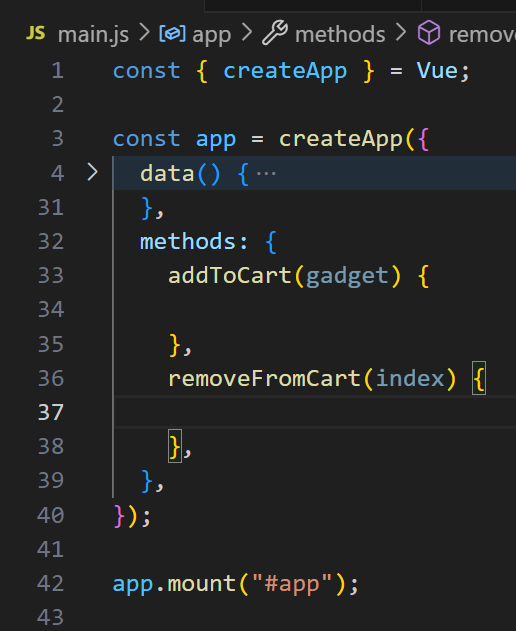

# Vue Gadget Shop - step5-challenge

## 🎯 Objectif

Dans cette étape, vous allez apprendre à **gérer les événements utilisateur** avec Vue 3 en utilisant **`v-on` (`@click`)**. Vous devez permettre aux utilisateurs **d’ajouter et de supprimer des articles du panier** en ajoutant des événements sur les boutons.

---

## 📂 Structure du projet

Votre projet doit contenir la structure suivante :

```bash
/vue-gadget-shop
│── index.html
│── main.js
│── style.css
│── /assets
│    ├── phone.jpg
│    ├── laptop.jpg
│    ├── earbuds.jpg
```

---

## 🚀 Challenge

Vous devez arriver au résultat suivant :


### 🎯 À faire :

✅ **Bouton `Ajouter un panier`**

Ajouter un bouton HTML (`<button>`) sous chaque gadget et faire en sorte que ce bouton soit désactivé si le Gadget est en rupture de stock.

Pour cela utilisé l'attribut HTML `disabled` et la directive `v-bind`.

✅ **HTML du panier**

Pour vous aider à mettre en place le panier, voilà le HTML à utiliser.
Il faudra bien sûr rendre dynamique ce code HTML grâce aux directives et aux moustaches {{ }}

```html
<div class="cart">
  <h2>🛒 Mon Panier (0)</h2>
  <ul>
    <li>
      Nom du gadget - 10€
      <button class="remove-btn">❌</button>
    </li>
  </ul>
  <p>Votre panier est vide.</p>
</div>
```

✅ **Ajouter le concept de panier dans `main.js`**

- Ajouter un tableau `card` dans `data()`
- Ajouter la méthode **`addToCart(gadget)`** pour ajouter un article au panier.
- Ajouter la méthode **`removeFromCart(index)`** pour supprimer un article du panier.



Vous devez bien sûr compléter le code des 2 méthodes !

✅ **Ajouter des événements utilisateur (`@click`)**

- Associer l’événement `click` au bouton **"Ajouter au panier"** en utilisant la directive `v-on` afin d'appeler la méthode `addToCart`.
- Associer l’événement `click` au bouton **"❌ Supprimer"** en utilisant la directive `v-on` afin d'appeler la méthode `removeFromCart`.

---

## 📌 Règles

- Vérifiez le rendu en ouvrant `index.html` dans votre navigateur.
- Assurez-vous que **les interactions fonctionnent bien** (ajout et suppression).

💡 Une fois terminé, **comparez votre solution avec `step5-solution.md`** pour voir si vous avez tout bien implémenté ! 🚀
