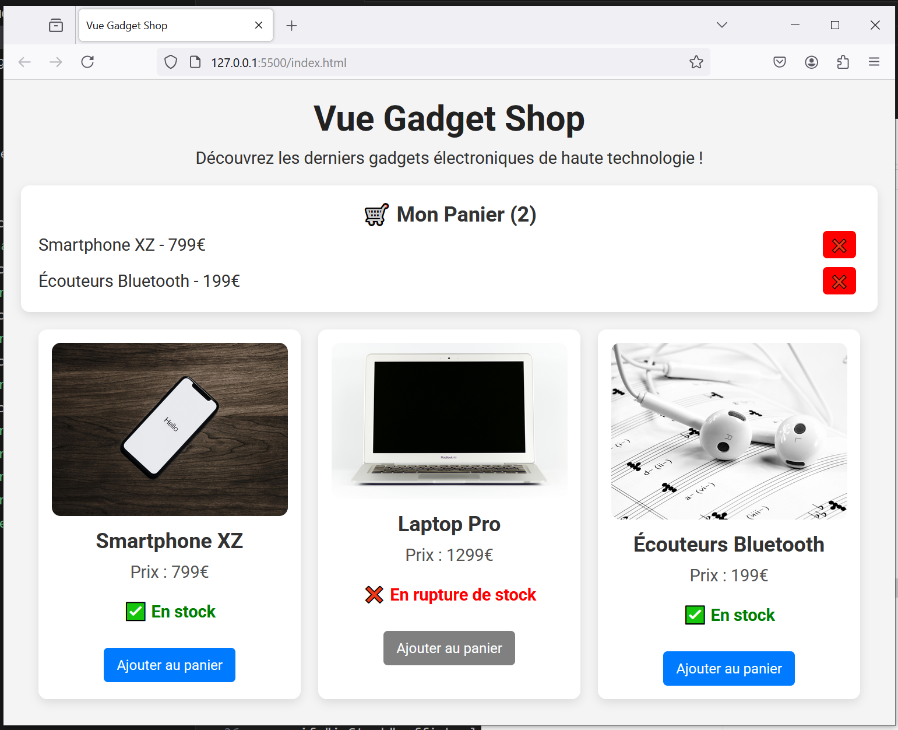

# Vue Gadget Shop - step5-challenge

## 🎯 Objectif

Dans cette étape, vous allez apprendre à **gérer les événements utilisateur** avec Vue 3 en utilisant **`v-on` (`@click`)**. Vous devez permettre aux utilisateurs **d’ajouter et de supprimer des articles du panier** en ajoutant des événements sur les boutons.

---

## 📂 Structure du projet

Votre projet doit contenir la structure suivante :

```bash
/vue-gadget-shop
│── index.html
│── main.js
│── style.css
│── /assets
│    ├── phone.jpg
│    ├── laptop.jpg
│    ├── earbuds.jpg
```

---

## 🚀 Challenge

Vous devez arriver au résultat suivant :



### 🎯 À faire :

✅ **Ajouter des événements utilisateur (`@click`)**

- Ajouter un bouton **"Ajouter au panier"** et lui associer l’événement `@click="addToCart(gadget)"`.
- Ajouter un bouton **"❌ Supprimer"** dans le panier et lui associer l’événement `@click="removeFromCart(index)"`.

✅ **Mettre à jour `main.js`**

- Ajouter la méthode **`addToCart(gadget)`** pour ajouter un article au panier.
- Ajouter la méthode **`removeFromCart(index)`** pour supprimer un article du panier.

✅ **Désactiver l’ajout d’un article en rupture de stock**

- Utiliser `:disabled="!gadget.inStock"` sur le bouton "Ajouter au panier".

---

## 📌 Règles

- Vous devez **utiliser uniquement Vue.js (CDN) et CSS**.
- Vérifiez le rendu en ouvrant `index.html` dans votre navigateur.
- Assurez-vous que **les interactions fonctionnent bien** (ajout et suppression).

💡 Une fois terminé, **comparez votre solution avec `step5-solution.md`** pour voir si vous avez tout bien implémenté ! 🚀
