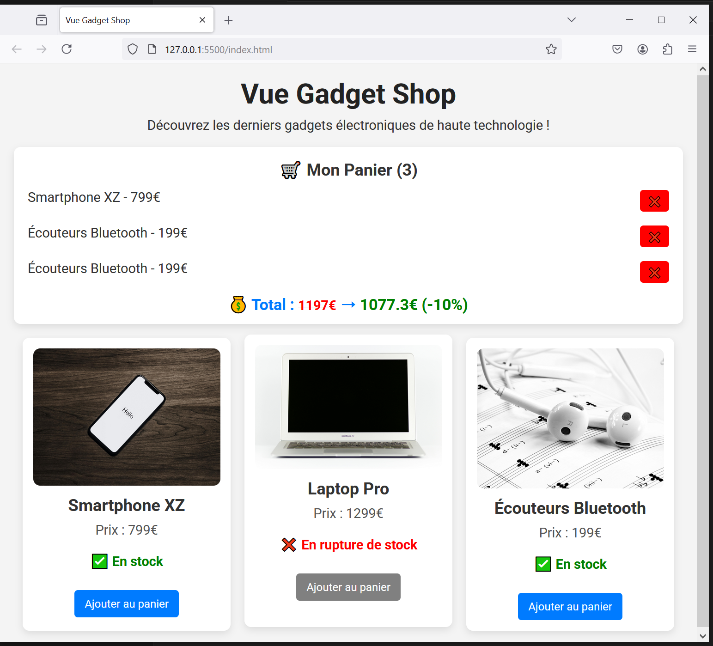

# Vue Gadget Shop - step6-challenge

## 🎯 Objectif

Dans cette étape, vous allez apprendre à utiliser **les propriétés calculées (`computed`)** pour gérer dynamiquement des valeurs dérivées des données existantes.

Vous devez :
✅ Calculer **le total du panier**.
✅ Appliquer une **réduction automatique de -10%** si le panier dépasse **1000€**.

---

## 📂 Structure du projet

Votre projet doit contenir la structure suivante :

```bash
/vue-gadget-shop
│── index.html
│── main.js
│── style.css
│── /assets
│    ├── phone.jpg
│    ├── laptop.jpg
│    ├── earbuds.jpg
```

---

## 🚀 Challenge

Vous devez arriver au résultat suivant :



### 🎯 À faire :

✅ **Ajouter une propriété calculée `cartTotal`**

- Cette propriété doit additionner les prix de tous les articles dans `cart`.

✅ **Ajouter une propriété calculée `discountedTotal`**

- Si `cartTotal` est inférieur à **1000€**, la valeur reste la même.
- Si `cartTotal` est supérieur ou égal à **1000€**, appliquez une réduction de **-10%**.

✅ **Afficher dynamiquement le total du panier dans `index.html`**

- Afficher **le total du panier** sous la liste des articles.
- Afficher **le prix réduit** si le panier dépasse **1000€**.
- Ajouter un effet **barré** (`<s>...</s>`) sur l'ancien prix.

---

## 📌 Règles

- Vous devez **utiliser uniquement Vue.js (CDN) et CSS**.
- Vérifiez le rendu en ouvrant `index.html` dans votre navigateur.
- Assurez-vous que **le total est mis à jour dynamiquement** lorsqu’un article est ajouté ou supprimé.

💡 Une fois terminé, **comparez votre solution avec `step6-solution.md`** pour voir si vous avez tout bien implémenté ! 🚀
