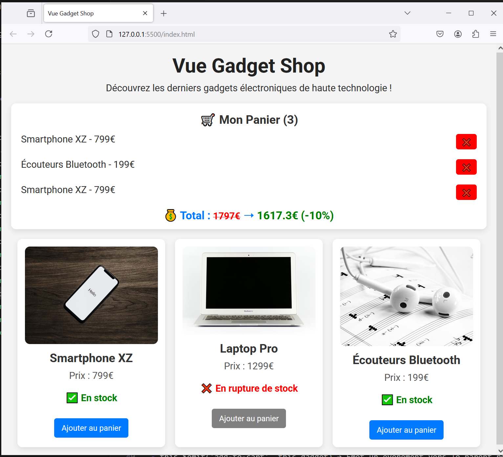

# Vue Gadget Shop - step7-challenge

## 🎯 Objectif

Dans cette étape, vous allez apprendre à **organiser votre code avec des composants Vue** en utilisant `app.component()`. L'objectif est de rendre le code plus modulaire et réutilisable.

Vous devez :
✅ Créer un **composant `GadgetDisplay`** pour afficher un gadget.
✅ Modifier `index.html` pour utiliser ce composant.
✅ Mettre à jour `main.js` pour enregistrer et gérer le composant.

---

## 📂 Structure du projet

Votre projet doit contenir la structure suivante :

```bash
/vue-gadget-shop
│── index.html
│── main.js
│── style.css
│── /components
│    ├── GadgetDisplay.js
│── /assets
│    ├── phone.jpg
│    ├── laptop.jpg
│    ├── earbuds.jpg
```

---

## 🚀 Challenge

Vous devez arriver au résultat suivant :



### 🎯 À faire :

✅ **Créer le fichier `components/GadgetDisplay.js`**

- Définir un composant `GadgetDisplay` qui reçoit une **prop `gadget`**.
- Afficher **l’image, le nom, le prix et l’état du stock**.
- Ajouter un **bouton "Ajouter au panier"**.
- Émettre un événement `add-to-cart` lorsque l’utilisateur clique sur le bouton.

✅ **Mettre à jour `index.html` pour utiliser le composant**

- Remplacer le rendu des gadgets par `<gadget-display>`.
- Passer les données avec `:gadget="gadget"`.
- Écouter l’événement `@add-to-cart` pour appeler `addToCart()`.

✅ **Mettre à jour `main.js` pour enregistrer le composant**

- Ajouter `app.component("gadget-display", GadgetDisplay);`.
- Vérifier que `addToCart()` fonctionne toujours.

---

## 📌 Règles

- Vous devez **utiliser uniquement Vue.js (CDN) et CSS**.
- Vérifiez le rendu en ouvrant `index.html` dans votre navigateur.
- Assurez-vous que **les gadgets s'affichent via le composant `GadgetDisplay`**.

💡 Une fois terminé, **comparez votre solution avec `step7-solution.md`** pour voir si vous avez tout bien implémenté ! 🚀
