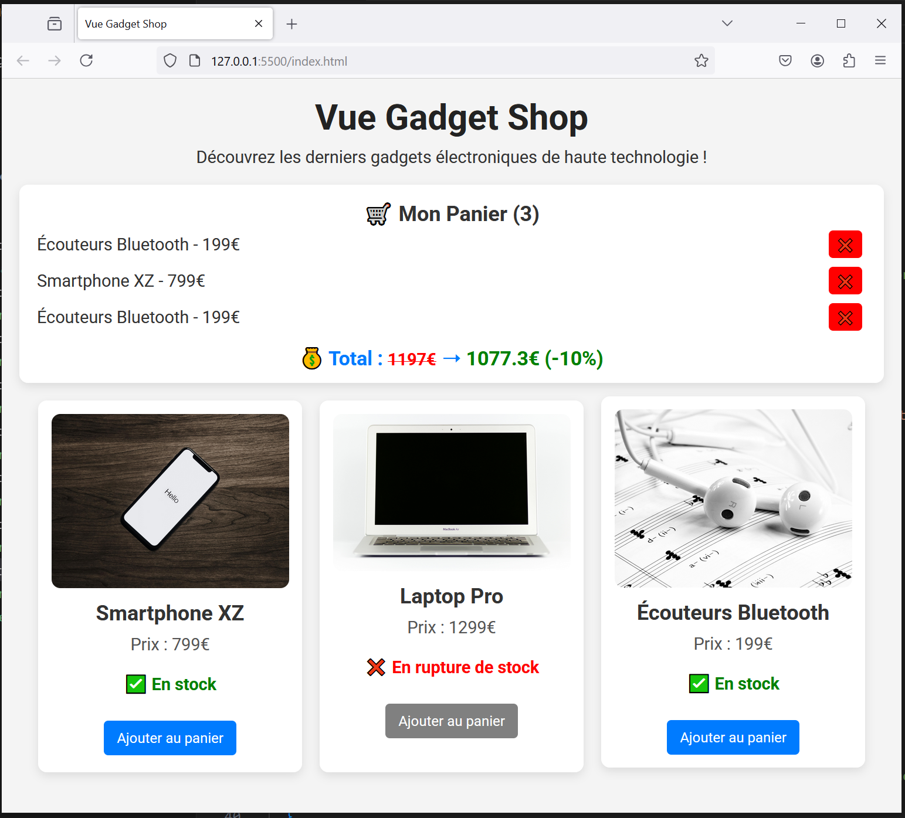

# Vue Gadget Shop - step8-challenge

## 🎯 Objectif

Dans cette étape, vous allez apprendre à **structurer davantage votre code avec un composant Vue** en créant **`CartDisplay.js`** pour gérer l'affichage et la gestion du panier.

Vous devez :
✅ Créer un **composant `CartDisplay`** pour afficher le panier et gérer la suppression des articles.
✅ Modifier `index.html` pour utiliser ce composant.
✅ Mettre à jour `main.js` pour enregistrer et gérer le composant.

---

## 📂 Structure du projet

Votre projet doit contenir la structure suivante :

```bash
/vue-gadget-shop
│── index.html
│── main.js
│── style.css
│── /components
│    ├── GadgetDisplay.js
│    ├── CartDisplay.js
│── /assets
│    ├── phone.jpg
│    ├── laptop.jpg
│    ├── earbuds.jpg
```

---

## 🚀 Challenge

Vous devez arriver au résultat suivant :



### 🎯 À faire :

✅ **Créer le fichier `components/CartDisplay.js`**

- Définir un composant `CartDisplay` qui reçoit **les props** `cart`, `cartTotal`, et `discountedTotal`.
- Afficher les **articles du panier** en liste avec `v-for`.
- Ajouter un **bouton "❌ Supprimer"** pour retirer un article.
- Émettre un événement `remove-from-cart` lorsqu’un article est supprimé.

✅ **Mettre à jour `index.html` pour utiliser le composant**

- Remplacer le rendu du panier par `<cart-display>`.
- Passer les données avec `:cart="cart"`, `:cart-total="cartTotal"`, et `:discounted-total="discountedTotal"`.
- Écouter l’événement `@remove-from-cart` pour appeler `removeFromCart()`.

✅ **Mettre à jour `main.js` pour enregistrer le composant**

- Ajouter `app.component("cart-display", CartDisplay);`.
- Vérifier que `removeFromCart()` fonctionne toujours.

---

## 📌 Règles

- Vous devez **utiliser uniquement Vue.js (CDN) et CSS**.
- Vérifiez le rendu en ouvrant `index.html` dans votre navigateur.
- Assurez-vous que **le panier s'affiche via le composant `CartDisplay`** et fonctionne correctement.

💡 Une fois terminé, **comparez votre solution avec `step8-solution.md`** pour voir si vous avez tout bien implémenté ! 🚀
