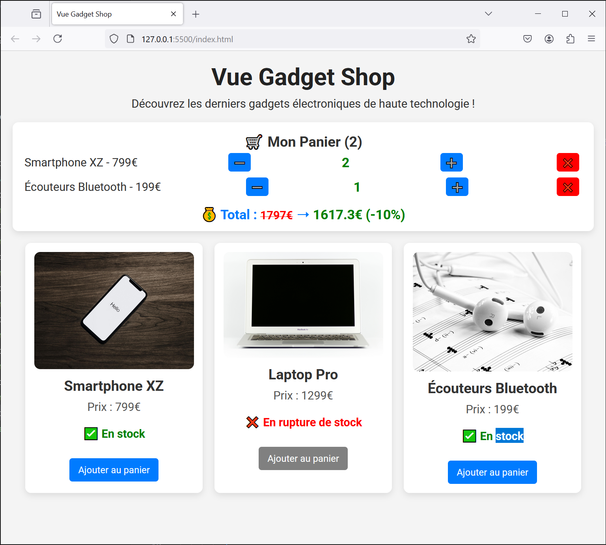

# Vue Gadget Shop - step9-challenge

## 🎯 Objectif

Dans cette étape, vous allez apprendre à **gérer la quantité des articles dans le panier** en modifiant `CartDisplay.js` et `main.js`.

Vous devez :
✅ Ajouter un **compteur `quantity`** pour chaque produit dans le panier.
✅ Ajouter des boutons **"➕" et "➖"** pour gérer la quantité.
✅ Supprimer un produit lorsque la quantité atteint **0**.
✅ Mettre à jour le total en fonction de la quantité.

---

## 📂 Structure du projet

Votre projet doit contenir la structure suivante :

```bash
/vue-gadget-shop
│── index.html
│── main.js
│── style.css
│── /components
│    ├── GadgetDisplay.js
│    ├── CartDisplay.js
│── /assets
│    ├── phone.jpg
│    ├── laptop.jpg
│    ├── earbuds.jpg
```

---

## 🚀 Challenge

Vous devez arriver au résultat suivant :



### 🎯 À faire :

✅ **Modifier `main.js` pour gérer la quantité**

- Dans `addToCart()`, vérifier si le produit est **déjà dans le panier** :
  - **Si oui**, **incrémenter** la quantité.
  - **Si non**, **ajouter** avec une quantité initiale de `1`.

✅ **Modifier `CartDisplay.js` pour afficher et gérer la quantité**

- Ajouter **deux boutons** "➕" et "➖" pour augmenter/diminuer la quantité.
- **Si la quantité atteint `0`, supprimer le produit du panier**.
- Mettre à jour dynamiquement le **total du panier** en fonction de la quantité.

✅ **Mettre à jour `index.html` pour utiliser CartDisplay.js**

- Remplacer l'ancien panier par `<cart-display>`.
- Passer les données avec `:cart="cart"`, `:cart-total="cartTotal"`, et `:discounted-total="discountedTotal"`.
- Écouter l’événement `@remove-from-cart`.

✅ **Améliorer le style des boutons avec `style.css`**

- Ajouter du style pour les boutons de gestion de quantité.

---

## 📌 Règles

- Vous devez **utiliser uniquement Vue.js (CDN) et CSS**.
- Vérifiez le rendu en ouvrant `index.html` dans votre navigateur.
- Assurez-vous que **la quantité est bien mise à jour et le total est recalculé dynamiquement**.

💡 Une fois terminé, **comparez votre solution avec `step9-solution.md`** pour voir si vous avez tout bien implémenté ! 🚀
